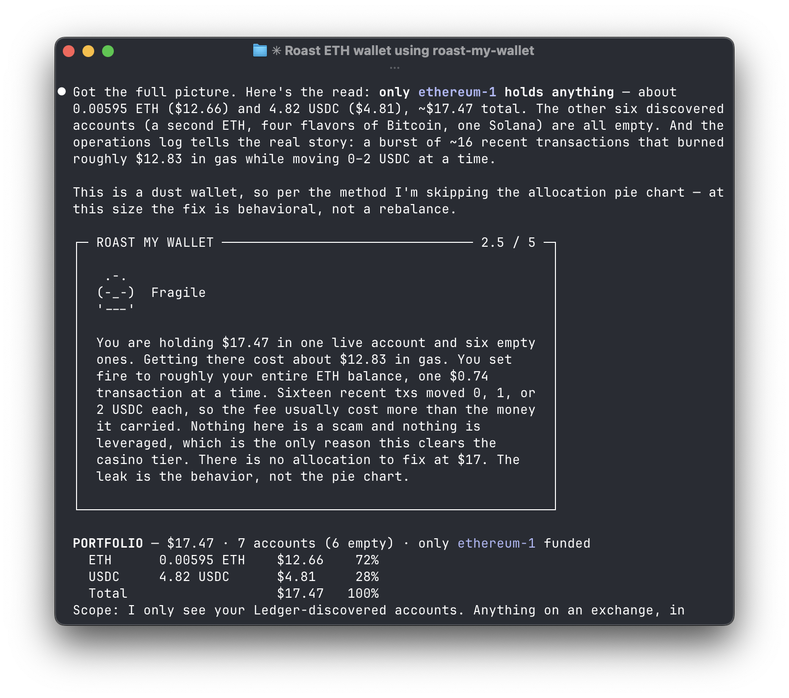

# Roast My Wallet



A Claude Code skill that turns your AI coding agent into a wallet roaster. Plug in your Ledger. Get observed. Sign one trade. Your hardware device is the only thing that can move funds.

## What this is

One markdown file driving [`@ledgerhq/wallet-cli`](https://www.npmjs.com/package/@ledgerhq/wallet-cli). No SDK, no Node wrapper, no API key — your AI coding agent (Claude Code, Codex, Cursor) is the LLM. The skill instructs the agent to:

1. Read your Ledger-discovered portfolio via wallet-cli
2. Fetch USD prices from CoinGecko
3. Run a **seven-sins structural diagnostic** — concentration, fake diversification, illiquidity, FOMO bags, no dry powder, yield traps, no exit logic
4. Deliver a sharp 3-5 sentence roast and a **1-5 score** with an escalating poo mascot (crying pile at 1, golden at 5) in the verdict box, then a data-first breakdown below it: a portfolio snapshot, a tight why-it-scored-that, a target allocation, and a long/spot/DeFi verdict
5. Recommend the highest-impact first move in plain language — and, on your yes, run a no-signing `swap quote` preview
6. Wait for your explicit yes (twice) before signing on your device

The roast is the hook. The rebuild is the point. The agent never touches your keys — the Ledger is the final gate.

## The score

Every roast closes with a 1-5 rating and a pure-ASCII mascot — a crying pile at 1, armed and armored by 4, golden at 5:

```
1 / 5 — Casino account        2 / 5 — Fragile
   .-.                           .-.
  (;_;)                         (-_-)
  '---'                         '---'

3 / 5 — The messy median      4 / 5 — Solid
   .-.                            .-.
  (o_o)>===                  []=(o_o)>===
  '---'                      []='---'

5 / 5 — Disciplined
 $.-.$
($^o^$)   GOLDEN
 '$$$'
```

## Install (Claude Code)

```bash
npm i -g @ledgerhq/wallet-cli@latest

mkdir -p ~/.claude/skills/roast-my-wallet
curl -fsSL https://raw.githubusercontent.com/GuitareCiel/roast-my-wallet/main/skills/roast-my-wallet/SKILL.md \
  -o ~/.claude/skills/roast-my-wallet/SKILL.md
```

Then plug in your Ledger, open the relevant network app on the device, and in Claude Code say:

> roast my wallet

(or "judge my portfolio", "what do you think of my bags", "rate my wallet" — all trigger the skill.)

## Install (Codex / Cursor / other agents)

These don't have a global skills directory. Paste the skill content into your agent's context:

```bash
# Codex
cat skills/roast-my-wallet/SKILL.md >> AGENTS.md

# Cursor
cat skills/roast-my-wallet/SKILL.md >> .cursor/rules
```

## First-run setup

The skill walks the agent through `wallet-cli account discover --network <name>` per network you hold (Bitcoin, Ethereum, Solana). You approve once on the device to export each xpub; after that, balance and operation reads happen without the device (xpubs are watch-only — they can derive public addresses but never private keys).

## Safety

- The agent never signs a transaction without explicit yes from you in chat **and** a second confirmation on your hardware device.
- The roast is satire and entertainment. The proposed trade is "for consideration."
- This is not financial advice.
- No telemetry. Portfolio data is read once per roast and forgotten.

## License

MIT.
